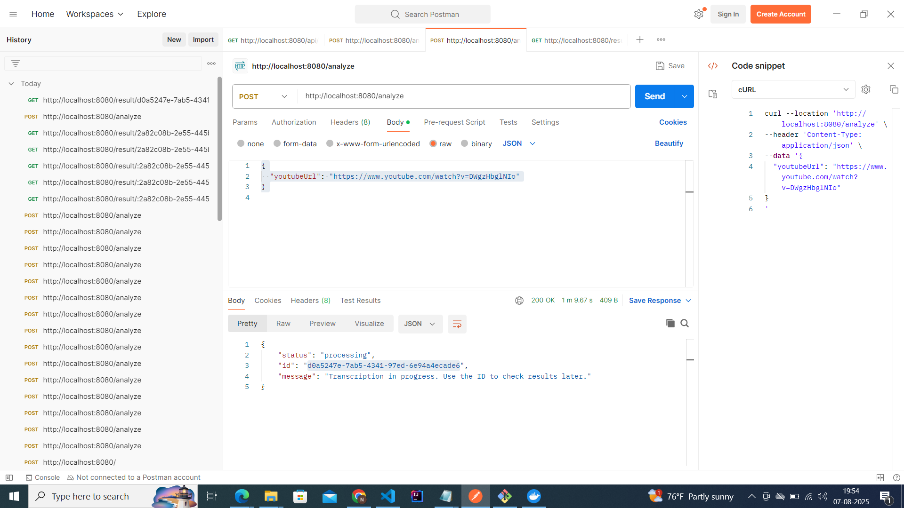
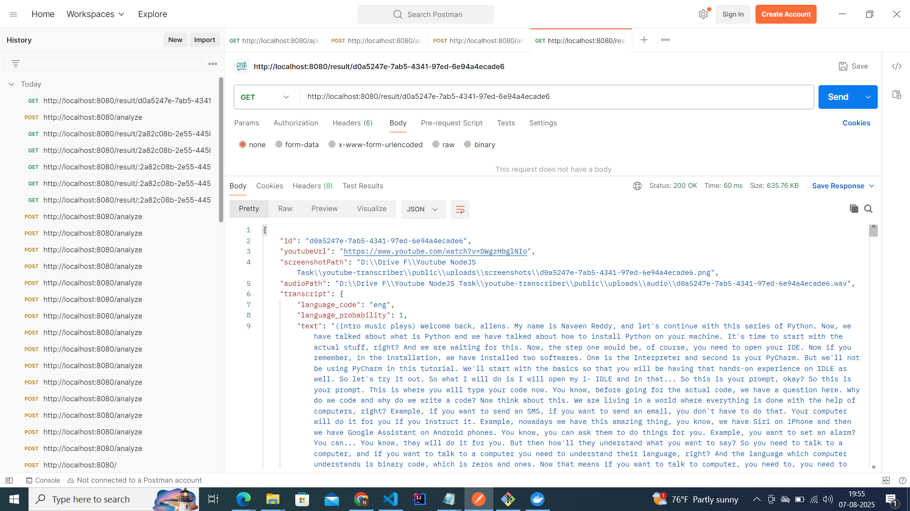
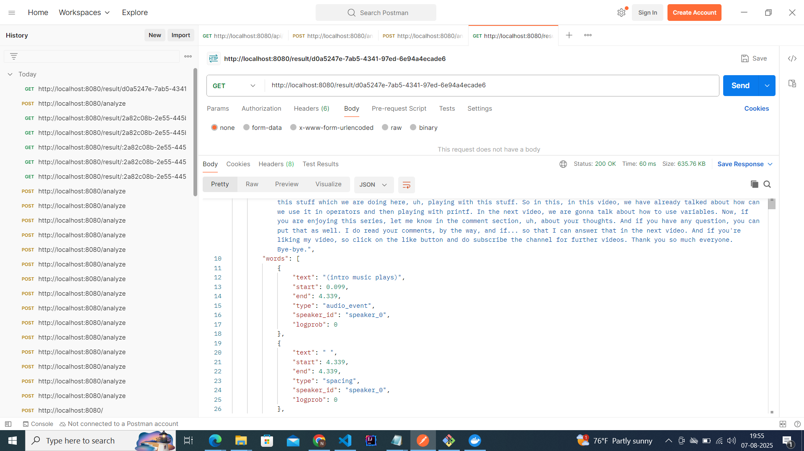
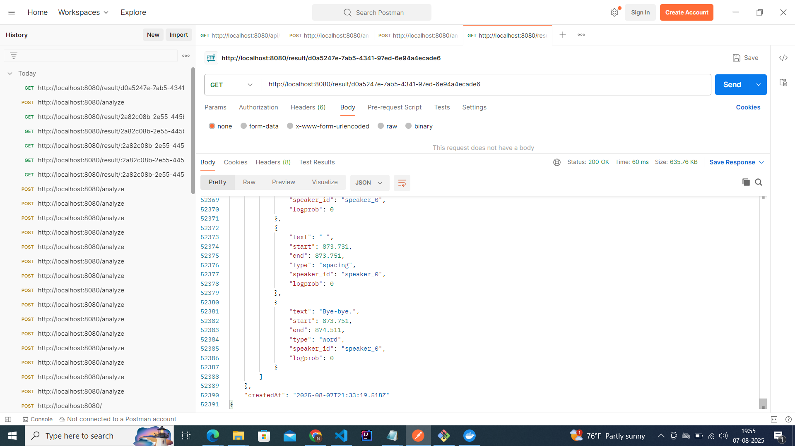

````markdown
# 🎬 YouTube Analysis Service

This is a Node.js service that analyzes YouTube videos by capturing playback, extracting audio, transcribing speech using ElevenLabs Scribe, detecting AI-generated content with GPTZero, and returning structured results via a REST API.

## 🔧 Features

- ✅ Accepts a YouTube URL via web form or REST POST
- 🧭 Uses Puppeteer to load the video, verify playback, and take a thumbnail screenshot
- 🎧 Extracts audio using ytdl-core + FFmpeg (16 kHz, mono, 16-bit WAV)
- 🧠 Transcribes using ElevenLabs Scribe (with timestamps + speaker diarization)
- 🤖 Analyzes sentences via GPTZero for AI probability
- 💾 Persists result as JSON + screenshot
- 🌐 GET API to retrieve analysis by ID
- 🐳 Docker & GCE-ready deployment

---

## 📦 API Endpoints

### POST `/analyze`

Submit a YouTube URL to begin analysis.

**Request:**

```json
{
  "youtubeUrl": "https://www.youtube.com/watch?v=DWgzHbglNIo"
}
```
````

**Response:**

```json
{
  "status": "processing",
  "id": "60eeaec7-0f1d-4212-9f22-94e203a18a3f",
  "message": "Transcription in progress. Use the ID to check results later."
}
```

### GET `/result/id`

Fetch the transcription and screenshot for a given result ID.

**Response:**

```json
{
  "screenshot": "/screenshots/60eeaec7-0f1d-4212-9f22-94e203a18a3f.png",
  "transcript": [
    {
      "text": "(intro music plays)",
      "start": 0.099,
      "end": 4.339,
      "type": "audio_event",
      "speaker_id": "speaker_0",
      "logprob": 0
    }
  ]
}
```

### Sample Output From Postman For -- Post



### Sample Output From Postman For -- Get





### Sample JSON Output

```json
{
  "id": "60eeaec7-0f1d-4212-9f22-94e203a18a3f",
  "youtubeUrl": "https://www.youtube.com/watch?v=DWgzHbglNIo",
  "screenshotPath": "/uploads/screenshots/60eeaec7-0f1d-4212-9f22-94e203a18a3f.png",
  "audioPath": "/uploads/audio/60eeaec7-0f1d-4212-9f22-94e203a18a3f.wav",
  "transcript": {
    "language_code": "eng",
    "language_probability": 1,
    "text": "(intro music plays) Welcome back, aliens. My name is Naveen Reddy, and let's continue with this series of Python. Now, we have talked about what is Python and we have talked about how to install Python on your machine. It's time to start with the actual stuff, right? And we are waiting for this...",
    "words": [
      {
        "text": "(intro music plays)",
        "start": 0.099,
        "end": 4.339,
        "type": "audio_event",
        "speaker_id": "speaker_0",
        "logprob": 0
      }
    ]
  },
  "createdAt": "2025-08-08T15:37:56.753Z"
}
```

---

## 🚀 Setup

### 1. Clone the repo

```bash
git clone https://github.com/naustd/youtube-analysis-task.git

```

### 2. Install dependencies

```bash
npm install
```

### 3. Create `.env` file

> ⚠️ `.env` is **not included** in the repo for security.

Example `.env`:

```env
PORT=8080
ELEVENLABS_API_KEY="Enter Your API KEY"
GPTZERO_API_KEY="Enter Your API KEY"
```

### 4. Start entire project

```bash
npm start
```

---

## 🐳 Docker Support

Use Docker Compose for one-liner deployment:

```bash
docker compose up --build
```

---

## ☁️ GCE Deployment

- Binds to `0.0.0.0:8080` for external access
- Create firewall rule to allow TCP port 8080
- SSH port forwarding:

  ```bash
  gcloud compute ssh INSTANCE_NAME --zone=ZONE -- -L 8080:localhost:8080
  ```

---

## 🧪 Sample Output

- JSON: `public/uploads/transcripts/55bc2f21-2c42-449c-abb3-18cffe45c26a.json`
- Screenshot: `public/uploads/screenshots/55bc2f21-2c42-449c-abb3-18cffe45c26a.png`
- audio: `public/uploads/audio/55bc2f21-2c42-449c-abb3-18cffe45c26a.wav`

---

## 🗂️ Project Structure

```
.
├── public/uploads
│           └── screenshots/
|           └── audio /
|           └── transcripts /
├── results/
│   └── transcripts/
├── src/
├── index.js
├── Dockerfile
├── docker-compose.yml
└── .env (not committed)
```

---

## 🎥 Demo

A short end-to-end demo showing video input, playback, transcription, and AI analysis is included.

📺 [YouTube Demo Video](https://youtu.be/HTUZvl2YM4I)

---

---

## 🙋 Contact

Maintained by [@naustd](https://github.com/naustd). Please open an issue for bugs or feature requests.

```
Let me know if you'd like it saved as a file for download or need it personalized with your actual domain/service name.
```
